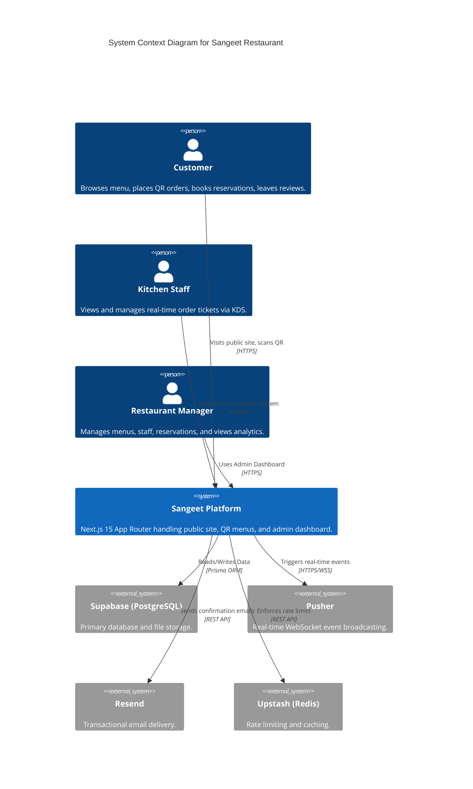
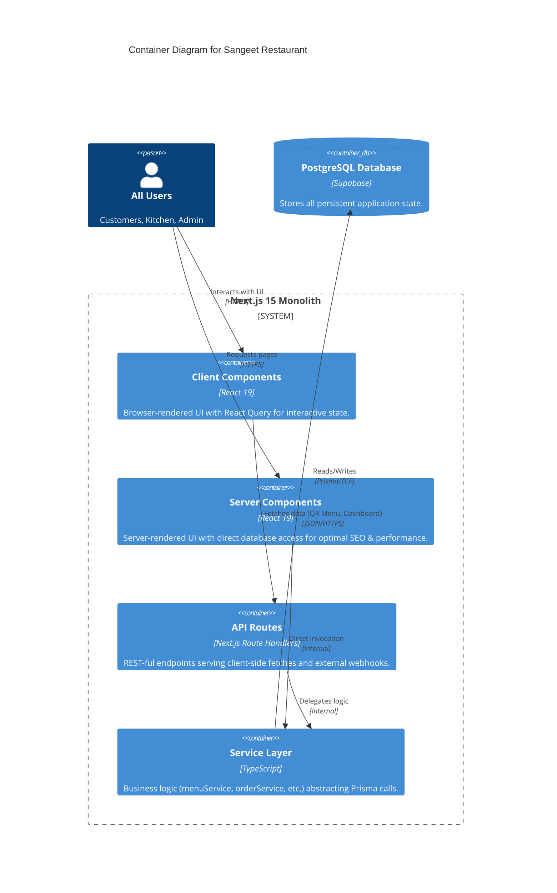

# System Architecture

This document describes the high-level architecture of the Sangeet Restaurant platform. The system was recently migrated from a decoupled Express.js/React stack into a modern **Next.js 15 Monolith**.

## High-Level Architecture (C4 Context)

The Sangeet Restaurant platform acts as the central hub connecting customers, kitchen staff, and management.

## Container Architecture

The application is structured as a monolithic Next.js repository using the App Router.

## Key Architectural Decisions

1. **Monolithic App Router (Next.js 15)**
   By moving away from a separate Express backend, we eliminate CORS issues, simplify deployment to a single provider (e.g., Vercel), and leverage Next.js Server Components for secure, direct database access on public pages.
   
2. **Real-Time Communication via Pusher**
   Next.js API routes are serverless, making native `Socket.IO` long-polling impossible. We use **Pusher** to broadcast events (like new orders or reservation updates) to subscribed clients in real-time.

3. **Prisma ORM**
   We use Prisma to ensure type-safe database queries. The database schema is the single source of truth, and generated types are used throughout the service layer.

4. **Rate Limiting with Upstash Redis**
   To protect public endpoints (like review submissions or reservation creation) from abuse, we use Upstash Redis for global edge-compatible rate limiting.

5. **State Management**
   - **Server State**: Managed via React Query (`@tanstack/react-query`) for client-side data fetching, caching, and synchronization.
   - **UI State**: Handled natively via React `useState` and `useReducer`.
   - **Render Optimization**: Use of `queueMicrotask` to handle state transitions preventing cascading React Compiler loops.
