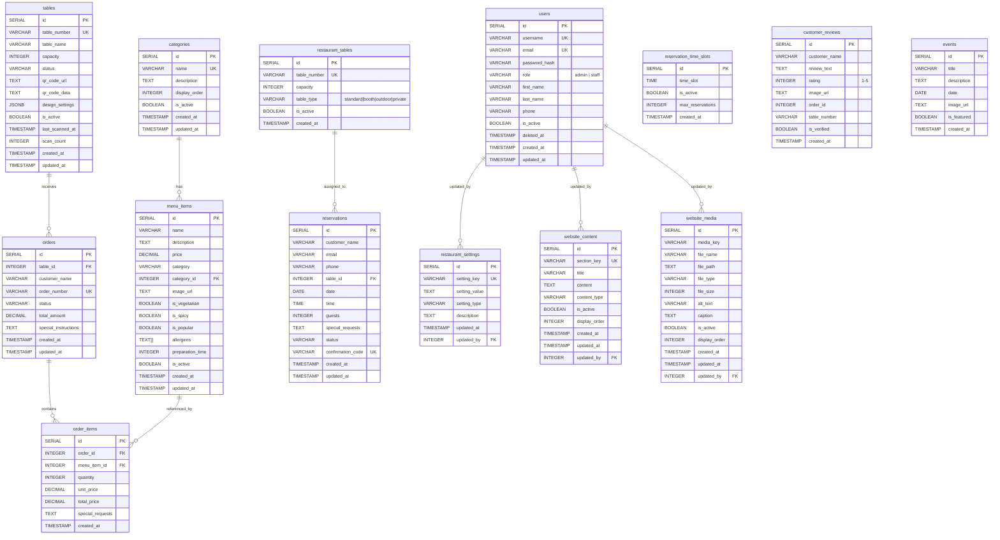
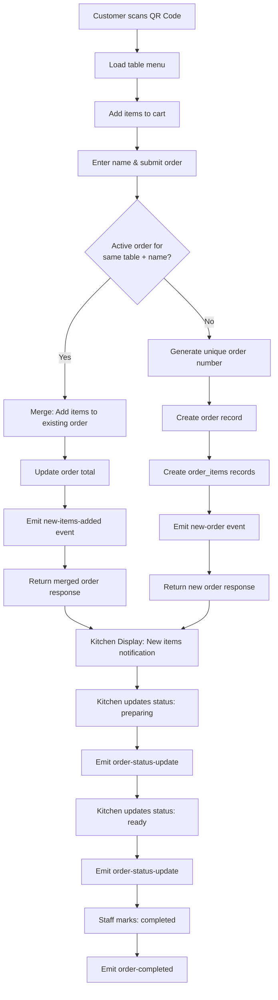
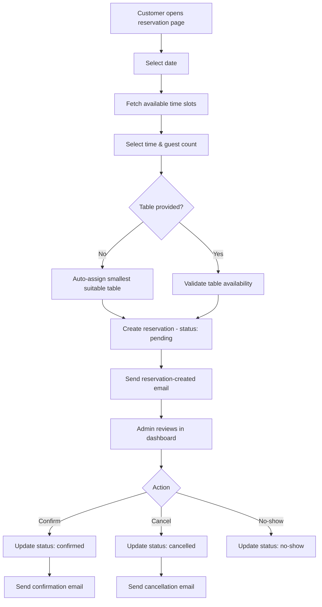

# 🍽️ Sangeet Restaurant — Comprehensive Project Documentation

> **Last Updated:** June 2026  
> **Version:** 1.0.0  
> **License:** MIT (proprietary usage for Sangeet Restaurant)

---

## Table of Contents

1. [Executive Summary](#executive-summary)
2. [Architecture Overview](#architecture-overview)
3. [Technology Stack](#technology-stack)
4. [Folder Structure](#folder-structure)
5. [Database Schema](#database-schema)
6. [API Documentation](#api-documentation)
7. [Authentication & Authorization](#authentication--authorization)
8. [User Roles & Permissions](#user-roles--permissions)
9. [Feature Breakdown](#feature-breakdown)
10. [Business Logic Flow](#business-logic-flow)
11. [Real-Time Communication](#real-time-communication)
12. [Configuration & Environment Variables](#configuration--environment-variables)
13. [Deployment Information](#deployment-information)
14. [Technical Debt & Missing Documentation](#technical-debt--missing-documentation)
15. [Future Improvement Suggestions](#future-improvement-suggestions)

---

## Executive Summary

**Sangeet Restaurant** is a full-stack restaurant management system built for an authentic Indian & Nepali cuisine restaurant based in **Hong Kong**. The platform provides:

- A **customer-facing website** for browsing menus, making reservations, and reading/leaving reviews.
- A **QR code-based table ordering system** where dine-in customers scan a QR code at their table, browse the menu, add items to a cart, and place orders — all from their phone.
- A **real-time kitchen display system** (KDS) that receives orders via WebSocket and allows kitchen staff to track and update order statuses.
- An **admin dashboard** for managing the entire restaurant operation: menu items, categories, QR codes, tables, reservations, orders, staff, website content, and business analytics.
- **Automated email notifications** for reservation lifecycle events (created, confirmed, cancelled).
- **Real-time order notifications** using Socket.IO across admin, kitchen, and customer interfaces.

The system follows a **monorepo** structure with separate `frontend/` and `backend/` directories, connected via npm workspaces. It is deployed with **Netlify** (frontend) and **Render** (backend), with an additional **Vercel** API adapter (`api/`).

---

## Architecture Overview

```
┌──────────────────────────────────────────────────────────────────────┐
│                        CLIENT LAYER                                  │
│                                                                      │
│  ┌─────────────────┐  ┌──────────────────┐  ┌─────────────────────┐ │
│  │  Public Website  │  │  QR Table Order  │  │  Admin Dashboard    │ │
│  │  (React SPA)     │  │  (React SPA)     │  │  (React SPA)        │ │
│  │  - Home          │  │  - QR Menu       │  │  - Orders Mgmt      │ │
│  │  - Menu          │  │  - Cart          │  │  - Menu Mgmt        │ │
│  │  - Reservations  │  │  - Order Success │  │  - QR Mgmt          │ │
│  │  - About         │  │  - Order Track   │  │  - Reservations     │ │
│  │  - Contact       │  │                  │  │  - Staff Mgmt       │ │
│  │  - Reviews       │  │                  │  │  - Website CMS      │ │
│  │  - Location      │  │                  │  │  - Analytics         │ │
│  └────────┬─────────┘  └────────┬─────────┘  └──────────┬──────────┘ │
│           │                     │                        │            │
│  ┌────────┴─────────────────────┴────────────────────────┴──────────┐│
│  │                   Socket.IO Client (Real-Time)                   ││
│  └──────────────────────────────┬───────────────────────────────────┘│
│                                 │                                    │
│  ┌──────────────────────────────┴───────────────────────────────────┐│
│  │                Kitchen Display System (KDS)                      ││
│  │                (Real-time order queue, status updates)            ││
│  └──────────────────────────────────────────────────────────────────┘│
└──────────────────────────────────┬───────────────────────────────────┘
                                   │  HTTP REST / WebSocket
                                   ▼
┌──────────────────────────────────────────────────────────────────────┐
│                        SERVER LAYER                                  │
│                                                                      │
│  ┌──────────────────────────────────────────────────────────────────┐│
│  │              Express.js REST API  (Node.js)                      ││
│  │                                                                  ││
│  │  Middleware:                                                      ││
│  │  ├── Helmet (Security headers)                                   ││
│  │  ├── CORS (Multi-origin)                                         ││
│  │  ├── Compression (gzip)                                          ││
│  │  ├── Rate Limiting (100 req/15min)                               ││
│  │  ├── JWT Authentication                                          ││
│  │  ├── Joi Validation                                              ││
│  │  ├── Multer (File uploads)                                       ││
│  │  ├── Request Logger (dev only)                                   ││
│  │  └── Error Handler                                               ││
│  │                                                                  ││
│  │  Routes: /api/auth, /api/menu, /api/orders, /api/tables,        ││
│  │          /api/reservations, /api/reviews, /api/events,           ││
│  │          /api/qr-codes, /api/website, /api/analytics             ││
│  └───────────────────────────┬──────────────────────────────────────┘│
│                              │                                       │
│  ┌───────────────────────────┴──────────────────────────────────────┐│
│  │              Socket.IO Server (Real-Time)                        ││
│  │  Rooms: admin-room, kitchen-room, customer-{id}, table-{num}    ││
│  └──────────────────────────────────────────────────────────────────┘│
│                              │                                       │
│  ┌───────────────────────────┴──────────────────────────────────────┐│
│  │              Utilities                                           ││
│  │  ├── Email Service (Nodemailer / Gmail)                          ││
│  │  ├── QR Code Generator (qrcode library)                          ││
│  │  ├── Beautiful QR Generator (sharp + custom designs)             ││
│  │  ├── Image Optimizer (sharp)                                     ││
│  │  └── Environment Validator                                       ││
│  └──────────────────────────────────────────────────────────────────┘│
└──────────────────────────────────┬───────────────────────────────────┘
                                   │
                                   ▼
┌──────────────────────────────────────────────────────────────────────┐
│                        DATA LAYER                                    │
│                                                                      │
│  ┌──────────────────────────────────────────────────────────────────┐│
│  │                    PostgreSQL Database                            ││
│  │                                                                  ││
│  │  Tables: users, menu_items, categories, orders, order_items,     ││
│  │          tables, reservations, restaurant_tables,                ││
│  │          reservation_time_slots, customer_reviews, events,       ││
│  │          restaurant_settings, website_content, website_media     ││
│  │                                                                  ││
│  │  Functions: check_table_availability(), get_available_tables(),  ││
│  │             generate_confirmation_code()                          ││
│  └──────────────────────────────────────────────────────────────────┘│
│                                                                      │
│  ┌──────────────────────────────────────────────────────────────────┐│
│  │                    File Storage                                   ││
│  │  uploads/website/  (media assets uploaded via CMS)               ││
│  └──────────────────────────────────────────────────────────────────┘│
└──────────────────────────────────────────────────────────────────────┘
```

---

## Technology Stack

### Frontend
| Technology | Version | Purpose |
|---|---|---|
| **React** | 18.2.x | UI framework (SPA) |
| **React Router DOM** | 6.20.x | Client-side routing |
| **Tailwind CSS** | Custom config | Utility-first CSS styling |
| **Framer Motion** | 10.16.x | Page transitions & animations |
| **Axios** | 1.6.x | HTTP client with interceptors |
| **Socket.IO Client** | 4.8.x | Real-time WebSocket communication |
| **Recharts** | 3.1.x | Data visualization (analytics charts) |
| **Lucide React** | 0.536.x | Icon library |
| **React Hook Form** | 7.48.x | Form handling & validation |
| **React Hot Toast** | 2.4.x | Notification toasts |
| **React Scripts** | 5.0.1 | CRA build tooling |

### Backend
| Technology | Version | Purpose |
|---|---|---|
| **Node.js** | 18.x | Runtime environment |
| **Express.js** | 4.18.x | Web framework |
| **PostgreSQL** | — | Relational database (via `pg` driver 8.11.x) |
| **Socket.IO** | 4.8.x | Real-time WebSocket server |
| **JSON Web Token** | 9.0.x | Authentication tokens |
| **bcryptjs** | 3.0.x | Password hashing |
| **Joi** | 17.11.x | Input validation schemas |
| **Multer** | 2.0.x | File upload handling |
| **Sharp** | 0.34.x | Image processing & QR card generation |
| **QRCode** | 1.5.x | QR code generation |
| **Nodemailer** | 7.0.x | Email notifications (Gmail SMTP) |
| **Helmet** | 7.1.x | Security headers |
| **CORS** | 2.8.x | Cross-origin resource sharing |
| **Compression** | 1.7.x | Response compression (gzip) |
| **express-rate-limit** | 7.1.x | API rate limiting |
| **dotenv** | 16.3.x | Environment variable loading |

### DevDependencies
| Technology | Purpose |
|---|---|
| **nodemon** | Backend auto-restart in development |
| **concurrently** | Run frontend & backend simultaneously |
| **jest** | Backend testing framework |

### Deployment & Infrastructure
| Service | Purpose |
|---|---|
| **Netlify** | Frontend hosting (static SPA with SPA redirects) |
| **Render** | Backend API hosting (Node.js web service) |
| **Vercel** | Alternative backend deployment (via `api/index.js`) |
| **PostgreSQL (Render)** | Managed database (with SSL in production) |

---

## Folder Structure

```
sangeet_restaurant_website/
├── package.json                    # Root monorepo config (npm workspaces)
├── render.yaml                     # Render deployment configuration
├── README.md                       # Project overview
├── DASHBOARD_FIXES_SUMMARY.md      # Documentation of real-time fixes
├── qr-card-template.html           # Printable QR card template (dark)
├── qr-card-template-white.html     # Printable QR card template (white)
│
├── api/                            # Vercel serverless API adapter
│   ├── index.js                    # Express app re-export for Vercel
│   └── package.json
│
├── backend/                        # Express.js API server
│   ├── package.json
│   ├── .env                        # Environment variables (gitignored)
│   ├── env.example                 # Environment template
│   ├── render.yaml                 # Backend-specific Render config
│   │
│   ├── src/
│   │   ├── index.js                # Entry point — server bootstrap
│   │   ├── socket.js               # Socket.IO initialization & event emitters
│   │   │
│   │   ├── config/
│   │   │   └── database.js         # PostgreSQL connection pool
│   │   │
│   │   ├── controllers/            # Business logic handlers
│   │   │   ├── analyticsController.js
│   │   │   ├── authController.js
│   │   │   ├── eventController.js
│   │   │   ├── menuController.js
│   │   │   ├── orderController.js
│   │   │   ├── qrController.js
│   │   │   ├── reservationController.js
│   │   │   ├── reviewController.js
│   │   │   └── websiteController.js
│   │   │
│   │   ├── middleware/
│   │   │   ├── auth.js             # JWT authentication & role checks
│   │   │   ├── errorHandler.js     # Global error handler
│   │   │   ├── imageMiddleware.js  # Image processing middleware
│   │   │   ├── notFoundHandler.js  # 404 handler
│   │   │   ├── requestLogger.js    # Dev request logging
│   │   │   └── validation.js       # Joi validation schemas
│   │   │
│   │   ├── routes/                 # API route definitions
│   │   │   ├── analytics.js
│   │   │   ├── auth.js
│   │   │   ├── events.js
│   │   │   ├── menu.js
│   │   │   ├── orders.js
│   │   │   ├── qr.js
│   │   │   ├── reservations.js
│   │   │   ├── reviews.js
│   │   │   ├── tables.js
│   │   │   └── website.js
│   │   │
│   │   └── utils/
│   │       ├── beautifulQRGenerator.js  # Premium QR card designs (sharp)
│   │       ├── emailService.js          # Nodemailer + HTML email templates
│   │       ├── environmentValidator.js  # Env var validation
│   │       ├── imageOptimizer.js        # Image resizing/compression
│   │       └── qrGenerator.js           # Basic QR code generation
│   │
│   ├── scripts/                    # Database migrations & seed scripts
│   │   ├── schema.sql              # Core schema (menu, reviews, events, categories)
│   │   ├── auth_schema.sql         # Users table
│   │   ├── orders_schema.sql       # Orders & order_items tables
│   │   ├── tables_schema.sql       # Tables (QR code management)
│   │   ├── reservation_schema.sql  # Reservations, time slots, functions
│   │   ├── website_schema.sql      # CMS tables (settings, content, media)
│   │   ├── qr_schema.sql           # Extended QR schema
│   │   ├── comprehensive_menu.sql  # Full menu seed data
│   │   ├── sample_reservations.sql # Sample reservation data
│   │   ├── add_deleted_at.sql      # Soft delete migration
│   │   ├── add_item_status.sql     # Item status migration
│   │   ├── migrate-render.js       # Production migration runner
│   │   ├── simple-migrate.js       # Simplified migration
│   │   ├── create_admin.js         # Admin user creation script
│   │   ├── setup_admin.js          # Admin setup utility
│   │   ├── setup_live_admin.js     # Production admin setup
│   │   ├── setup_local_time_slots.js  # Time slot configuration
│   │   ├── fix-render-database.js  # Database repair utility
│   │   ├── fix_qr_urls.js          # QR URL migration fix
│   │   └── regenerate_all_qr_codes.js  # QR regeneration utility
│   │
│   └── uploads/                    # File upload directory
│       └── website/                # Website media uploads
│
└── frontend/                       # React SPA
    ├── package.json
    ├── .env                        # Dev environment variables
    ├── .env.production             # Production environment variables
    ├── netlify.toml                # Netlify build & redirect config
    ├── tailwind.config.js          # Tailwind CSS configuration
    │
    ├── public/                     # Static assets
    │
    └── src/
        ├── index.js                # React entry point
        ├── index.css               # Global styles
        ├── App.js                  # Root component with routing
        │
        ├── assets/                 # Static assets (images, fonts)
        │
        ├── components/             # Reusable UI components
        │   ├── Header.js           # Site navigation header
        │   ├── Footer.js           # Site footer
        │   ├── AdminHeader.js      # Admin dashboard header
        │   ├── CartView.js         # QR order cart component
        │   ├── MenuView.js         # Menu display component
        │   ├── OrderQueue.js       # Kitchen order queue display
        │   ├── ProtectedRoute.js   # Auth-gated route wrapper
        │   ├── RealTimeNotifications.js  # WebSocket notification bell
        │   ├── ReviewModal.js      # Review submission modal
        │   ├── ReviewsSection.js   # Reviews display section
        │   ├── SuccessView.js      # Order success display
        │   ├── TrackingView.js     # Order tracking display
        │   ├── CustomDropdown.js   # Custom dropdown component
        │   └── ErrorBoundary.js    # React error boundary
        │
        ├── pages/                  # Page-level components
        │   ├── HomePage.js         # Landing page
        │   ├── MenuPage.js         # Full menu display
        │   ├── AboutPage.js        # About the restaurant
        │   ├── ContactPage.js      # Contact information
        │   ├── LocationPage.js     # Location & maps
        │   ├── ReservationsPage.js # Public reservation form
        │   ├── ReviewSubmissionPage.js  # Review submission form
        │   ├── LoginPage.js        # Admin/staff login
        │   ├── NotFoundPage.js     # 404 page
        │   │
        │   ├── QRMenuPage.js       # QR-scanned menu view
        │   ├── QRCartPage.js       # QR order cart page
        │   ├── QRCodeDisplayPage.js # QR code viewer
        │   ├── OrderSuccessPage.js # Post-order confirmation
        │   ├── OrderTrackingPage.js # Live order tracking
        │   │
        │   ├── AdminDashboard.js   # Admin overview dashboard
        │   ├── UnifiedDashboardPage.js # Unified dashboard page
        │   ├── AdminOrdersPage.js  # Admin order management
        │   ├── OrderManagementPage.js  # Order management
        │   ├── UnifiedOrderPage.js # Unified order page
        │   ├── MenuManagementPage.js   # Menu CRUD management
        │   ├── QRManagementPage.js # QR code management
        │   ├── KitchenDisplayPage.js   # Kitchen display system
        │   ├── ReservationManagementPage.js  # Reservation admin
        │   ├── StaffManagementPage.js  # User/staff management
        │   ├── RestaurantWebsiteManagementPage.js # CMS
        │   └── AnalyticsReportsPage.js  # Analytics & reports
        │
        ├── services/
        │   ├── api.js              # Axios API client (all endpoints)
        │   └── socketService.js    # Socket.IO client singleton
        │
        └── utils/
            ├── auth.js             # Auth helper functions
            ├── cartUtils.js        # Cart localStorage helpers
            └── itemUtils.js        # Menu item utility functions
```

---

## Database Schema

### Entity Relationship Diagram



### Database Functions (PL/pgSQL)

| Function | Purpose |
|---|---|
| `check_table_availability(table_id, date, time, guests)` | Validates table capacity and conflicts for a given slot |
| `get_available_tables(date, time, guests)` | Returns all suitable tables with no booking conflicts |
| `generate_confirmation_code()` | Generates unique reservation confirmation codes |

### Key Indexes

| Table | Index | Columns |
|---|---|---|
| `menu_items` | `idx_menu_items_category_id` | `category_id` |
| `menu_items` | `idx_menu_items_is_active` | `is_active` |
| `orders` | `idx_orders_table_id` | `table_id` |
| `orders` | `idx_orders_status` | `status` |
| `orders` | `idx_orders_created_at` | `created_at` |
| `order_items` | `idx_order_items_order_id` | `order_id` |
| `reservations` | `idx_reservations_date` | `date` |
| `reservations` | `idx_reservations_status` | `status` |
| `users` | `idx_users_username` | `username` |
| `users` | `idx_users_email` | `email` |

---

## API Documentation

### Base URL
- **Development:** `http://localhost:5001/api`
- **Production (Render):** `https://sangeet-restaurant-api.onrender.com/api`
- **Production (Vercel):** Deployed via `api/index.js`

### Health Check

| Method | Endpoint | Auth | Description |
|---|---|---|---|
| `GET` | `/api/health` | ❌ | Service health check |

---

### Authentication (`/api/auth`)

| Method | Endpoint | Auth | Description |
|---|---|---|---|
| `POST` | `/auth/login` | ❌ | Login with username/email + password. Returns JWT (24h expiry) |
| `GET` | `/auth/profile` | 🔒 Staff+ | Get current user profile |
| `PUT` | `/auth/change-password` | 🔒 Staff+ | Change own password |
| `GET` | `/auth/users/stats` | 🔒 Admin | Get user statistics (totals, by role) |
| `GET` | `/auth/users` | 🔒 Admin | List all users |
| `POST` | `/auth/users` | 🔒 Admin | Create new user |
| `PUT` | `/auth/users/:id` | 🔒 Admin | Update user |
| `DELETE` | `/auth/users/:id` | 🔒 Admin | Soft-delete user (sets `deleted_at`) |
| `PATCH` | `/auth/users/:id/toggle-status` | 🔒 Admin | Activate/deactivate user |

---

### Menu (`/api/menu`)

| Method | Endpoint | Auth | Description |
|---|---|---|---|
| `GET` | `/menu/items` | ❌ | Get all active menu items (filterable by category, search, sort) |
| `GET` | `/menu/items/:id` | ❌ | Get single menu item |
| `POST` | `/menu/items` | 🔒 Admin | Create menu item |
| `PUT` | `/menu/items/:id` | 🔒 Admin | Update menu item |
| `DELETE` | `/menu/items/:id` | 🔒 Admin | Soft-delete menu item (sets `is_active=false`) |
| `GET` | `/menu/categories` | ❌ | Get all active categories with item counts |
| `POST` | `/menu/categories` | 🔒 Admin | Create category |
| `PUT` | `/menu/categories/:id` | 🔒 Admin | Update category |
| `DELETE` | `/menu/categories/:id` | 🔒 Admin | Soft-delete category |
| `GET` | `/menu/stats` | 🔒 Admin | Menu statistics |

---

### Orders (`/api/orders`)

| Method | Endpoint | Auth | Description |
|---|---|---|---|
| `POST` | `/orders` | ❌ | Create new order (or merge items into existing active order) |
| `GET` | `/orders` | 🔒 Staff+ | Get all orders (filterable by status, table) |
| `GET` | `/orders/stats` | 🔒 Staff+ | Order statistics |
| `GET` | `/orders/search` | 🔒 Staff+ | Search orders by name, number, date, status |
| `GET` | `/orders/:id` | ❌ | Get single order (with table validation via query param) |
| `GET` | `/orders/table/:tableId` | ❌ | Get orders by table ID |
| `GET` | `/orders/table-number/:tableNumber` | ❌ | Get orders by table number |
| `PATCH` | `/orders/:id/status` | 🔒 Staff+ | Update order status (enforces valid transitions) |
| `DELETE` | `/orders/:id` | 🔒 Staff+ | Hard-delete order and items |

**Order Status Flow:**
```
pending → preparing → ready → completed
    ↓          ↓         ↓
 cancelled  cancelled  cancelled
```

---

### Tables (`/api/tables`)

| Method | Endpoint | Auth | Description |
|---|---|---|---|
| `GET` | `/tables` | ❌ | Get all active tables |
| `GET` | `/tables/qr/:qrCode` | ❌ | Get table by QR code URL fragment |
| `POST` | `/tables` | 🔒 Admin | Create table |
| `PUT` | `/tables/:id` | 🔒 Admin | Update table |
| `DELETE` | `/tables/:id` | 🔒 Admin | Delete table |

---

### QR Codes (`/api/qr-codes`)

| Method | Endpoint | Auth | Description |
|---|---|---|---|
| `GET` | `/qr-codes` | 🔒 Staff+ | Get all QR codes with order analytics |
| `POST` | `/qr-codes/generate/table` | 🔒 Admin | Generate QR code for a table |
| `POST` | `/qr-codes/generate/bulk` | 🔒 Admin | Bulk generate QR codes |
| `GET` | `/qr-codes/analytics/:qrCodeId` | 🔒 Staff+ | QR code usage analytics |
| `PUT` | `/qr-codes/:qrCodeId/design` | 🔒 Admin | Update QR code design |
| `DELETE` | `/qr-codes/:qrCodeId` | 🔒 Admin | Delete QR code (blocked if active orders exist) |
| `GET` | `/qr-codes/print/:qrCodeId/:format` | 🔒 Staff+ | Download printable QR code (PNG/SVG, multiple designs) |

---

### Reservations (`/api/reservations`)

| Method | Endpoint | Auth | Description |
|---|---|---|---|
| `GET` | `/reservations` | 🔒 Staff+ | Get all reservations (filterable) |
| `GET` | `/reservations/:id` | 🔒 Staff+ | Get single reservation |
| `POST` | `/reservations` | ❌ | Create reservation (triggers email) |
| `PUT` | `/reservations/:id` | 🔒 Staff+ | Update reservation |
| `PATCH` | `/reservations/:id/status` | 🔒 Staff+ | Update status (triggers confirmation/cancellation emails) |
| `DELETE` | `/reservations/:id` | 🔒 Staff+ | Hard-delete reservation |
| `GET` | `/reservations/available-tables` | ❌ | Get available tables for date/time/guests |
| `GET` | `/reservations/available-times` | ❌ | Get available time slots for a date |
| `GET` | `/reservations/check-availability` | ❌ | Check specific table availability |
| `GET` | `/reservations/stats` | 🔒 Staff+ | Reservation statistics |

**Reservation Status Flow:**
```
pending → confirmed → seated → completed
    ↓         ↓
cancelled   cancelled
    ↓         ↓
 no-show    no-show
```

---

### Reviews (`/api/reviews`)

| Method | Endpoint | Auth | Description |
|---|---|---|---|
| `GET` | `/reviews` | ❌ | Get all reviews |
| `GET` | `/reviews/verified` | ❌ | Get verified reviews only |
| `GET` | `/reviews/:id` | ❌ | Get single review |
| `POST` | `/reviews` | ❌ | Submit new review (rating 1-5) |
| `PATCH` | `/reviews/:id/verify` | 🔒 Admin | Toggle review verification |
| `DELETE` | `/reviews/:id` | 🔒 Admin | Hard-delete review |
| `GET` | `/reviews/stats` | 🔒 Admin | Review statistics |

---

### Events (`/api/events`)

| Method | Endpoint | Auth | Description |
|---|---|---|---|
| `GET` | `/events` | ❌ | Get all events |
| `GET` | `/events/featured` | ❌ | Get featured events |
| `GET` | `/events/upcoming` | ❌ | Get upcoming events |
| `GET` | `/events/:id` | ❌ | Get single event |
| `POST` | `/events` | 🔒 Admin | Create event |
| `PUT` | `/events/:id` | 🔒 Admin | Update event |
| `DELETE` | `/events/:id` | 🔒 Admin | Hard-delete event |
| `GET` | `/events/stats` | 🔒 Admin | Event statistics |

---

### Website CMS (`/api/website`)

| Method | Endpoint | Auth | Description |
|---|---|---|---|
| `GET` | `/website/settings` | ❌ | Get restaurant settings |
| `PUT` | `/website/settings` | 🔒 Admin | Update restaurant settings (transactional upsert) |
| `GET` | `/website/content` | ❌ | Get website content sections |
| `PUT` | `/website/content` | 🔒 Admin | Update website content (transactional upsert) |
| `GET` | `/website/media` | ❌ | Get website media files |
| `POST` | `/website/media` | 🔒 Admin | Upload media (image, max 5MB) |
| `DELETE` | `/website/media/:id` | 🔒 Admin | Soft-delete media |
| `GET` | `/website/stats` | 🔒 Admin | Website content statistics |

---

### Analytics (`/api/analytics`)

| Method | Endpoint | Auth | Description |
|---|---|---|---|
| `GET` | `/analytics/business` | 🔒 Admin | Overall business analytics (configurable timeframe) |
| `GET` | `/analytics/reservations/trends` | 🔒 Admin | Reservation trends (daily/monthly/yearly) |
| `GET` | `/analytics/menu` | 🔒 Admin | Menu category breakdown & popular items |
| `GET` | `/analytics/customers` | 🔒 Admin | Customer insights (day-of-week patterns, peak hours) |
| `GET` | `/analytics/performance` | 🔒 Admin | Performance metrics with date range filtering |
| `GET` | `/analytics/export` | 🔒 Admin | Export data as JSON or CSV |

---

## Authentication & Authorization

### Authentication Flow

```
1. User submits credentials → POST /api/auth/login
2. Server validates username/email + bcrypt password hash
3. Server generates JWT token:
   Payload: { id, username, role, email }
   Expiry: 24 hours
   Secret: JWT_SECRET env var (fallback: 'sangeet-restaurant-secret-key')
4. Client stores token in localStorage (keys: 'token', 'authToken', 'adminToken')
5. Client sends token via Authorization: Bearer <token> header
6. Server middleware (authenticateToken) validates JWT on protected routes
7. On 401/403, client clears tokens and redirects to /login
```

### Middleware Chain

```
authenticateToken → Validates JWT, sets req.user
requireAuth       → Requires 'admin' or 'staff' role
requireAdmin      → Requires 'admin' role only
```

### Token Storage (Frontend)
The frontend stores tokens in **localStorage** across multiple keys for backward compatibility:
- `token` / `authToken` / `adminToken` — JWT token
- `user` / `authUser` / `adminUser` / `kitchenUser` — User profile JSON

### Security Measures
- **Helmet** security headers (CSP, HSTS, etc.)
- **CORS** restricted to specific origins (localhost, Vercel, Render, Netlify patterns)
- **Rate limiting** — 100 requests per 15-minute window
- **bcryptjs** with 10 salt rounds for password hashing
- **Soft deletes** for users (via `deleted_at` column)
- Admin self-deletion protection
- Last-admin deletion/deactivation protection

---

## User Roles & Permissions

| Role | Login | View Orders | Manage Orders | Manage Menu | Manage QR | Manage Reservations | Manage Staff | CMS | Analytics |
|---|---|---|---|---|---|---|---|---|---|
| **Admin** | ✅ | ✅ | ✅ | ✅ | ✅ | ✅ | ✅ | ✅ | ✅ |
| **Staff** | ✅ | ✅ | ✅ | ❌ | ❌ | ✅ | ❌ | ❌ | ❌ |
| **Customer** | ❌ | Own table only | Create only | ❌ | ❌ | Create only | ❌ | ❌ | ❌ |

### Customer Actions (Unauthenticated)
- Browse public website (Home, Menu, About, Contact, Location)
- Scan QR code → browse table menu → add to cart → place order
- Track own order status in real-time
- Create reservations (with email notification)
- Submit reviews
- View upcoming events

---

## Feature Breakdown

### 1. Public Website
- **Home Page** — Hero section, featured menu items, reviews carousel, upcoming events, reservation CTA
- **Menu Page** — Full menu with category filtering, search, dietary indicators
- **About Page** — Restaurant story, team information
- **Contact Page** — Contact form, information display
- **Location Page** — Address, map integration
- **Reservation Page** — Date/time picker, available slots, guest count, form submission with auto table assignment

### 2. QR Code Table Ordering System
- Customers scan a QR code printed at their table
- Opens mobile-optimized menu view (`/qr/table-{number}`)
- Add items to cart with quantity and special requests
- Place order — linked to table number and customer name
- **Order merging** — subsequent orders from the same customer/table merge into the existing active order
- Real-time order tracking via Socket.IO
- Order success page with order summary

### 3. Kitchen Display System (KDS)
- Real-time order feed via Socket.IO
- Orders grouped by status (pending → preparing → ready)
- One-click status advancement
- Audio notifications for new orders
- Browser notifications (with permission)
- Auto-refresh and reconnection handling

### 4. Admin Dashboard
- **Order Management** — View all orders, filter by status/table, update status, delete orders, bulk status updates, search
- **Menu Management** — CRUD for menu items and categories, dietary flags, pricing, images
- **QR Code Management** — Generate/delete/bulk-generate QR codes, custom designs, analytics per QR code, downloadable printable QR cards (classic/premium/large designs, multiple themes)
- **Reservation Management** — View/filter/update/cancel reservations, statistics
- **Staff Management** — CRUD for admin/staff users, toggle active status, user statistics
- **Website CMS** — Edit restaurant settings (name, hours, socials), website content sections, media upload/management
- **Analytics & Reports** — Business overview, reservation trends, menu analytics, customer insights, peak hours, data export (JSON/CSV)
- **Unified Dashboard** — Combined overview of all modules

### 5. Email Notifications (Nodemailer)
- **Reservation Created** — Beautiful HTML email to customer acknowledging booking
- **Reservation Confirmed** — Rich confirmation email with details, dress code, arrival instructions
- **Reservation Cancelled** — Cancellation notice with re-booking encouragement
- Gracefully degrades: logs emails if `EMAIL_USER`/`EMAIL_PASSWORD` not configured

### 6. Real-Time Notifications (Socket.IO)
- Admin/kitchen receive instant new order alerts
- Order status updates broadcast to relevant rooms
- New items added to existing orders trigger kitchen alerts
- Order deletion notifies frontend to clear cart data
- Audio beeps and browser notifications
- Connection status indicators with exponential backoff reconnection

---

## Business Logic Flow

### Order Placement Workflow



### Reservation Workflow



---

## Real-Time Communication

### Socket.IO Architecture

**Server-side rooms:**
| Room | Joined By | Events Received |
|---|---|---|
| `admin-room` | Admin dashboard pages | `new-order`, `order-status-update`, `new-items-added`, `order-completed`, `order-cancelled`, `order-deleted` |
| `kitchen-room` | Kitchen display | Same as admin-room |
| `customer-{orderId}` | Customer tracking an order | `order-status-update` |
| `table-{tableNumber}` | Customer at a specific table | `order-status-update`, `order-deleted` |

**Events emitted by server:**
| Event | Trigger | Data |
|---|---|---|
| `new-order` | Order created | Full order object with items |
| `order-status-update` | Status changed | `{ orderId, status, tableNumber, estimatedTime, timestamp }` |
| `new-items-added` | Items merged into existing order | `{ orderId, newItems, tableNumber, timestamp }` |
| `order-completed` | Order marked completed | `{ orderId, timestamp, sound }` |
| `order-cancelled` | Order cancelled | `{ orderId, reason, timestamp }` |
| `order-deleted` | Order hard-deleted | `{ orderId, tableNumber, timestamp }` |

---

## Configuration & Environment Variables

### Backend (`.env`)

| Variable | Required | Default | Description |
|---|---|---|---|
| `DATABASE_URL` | ✅ | `postgresql://localhost:5432/sangeet_restaurant` | PostgreSQL connection string |
| `JWT_SECRET` | ✅ | `sangeet-restaurant-secret-key` | JWT signing secret |
| `PORT` | ❌ | `5001` | Server port |
| `NODE_ENV` | ❌ | `development` | Environment mode |
| `CLIENT_URL` | ❌ | `http://localhost:3000` | Frontend URL for CORS |
| `FRONTEND_URL` | ❌ | — | Alternative frontend URL |
| `MAX_FILE_SIZE` | ❌ | `5242880` (5MB) | Upload size limit |
| `UPLOAD_PATH` | ❌ | `./uploads` | Upload directory |
| `EMAIL_USER` | ❌ | — | Gmail address for sending emails |
| `EMAIL_PASSWORD` | ❌ | — | Gmail app password |

### Frontend (`.env`)

| Variable | Required | Default | Description |
|---|---|---|---|
| `REACT_APP_API_URL` | ❌ | `http://localhost:5001/api` | Backend API base URL |
| `REACT_APP_SOCKET_URL` | ❌ | `https://sangeet-restaurant-api.onrender.com` | Socket.IO server URL |

### Configuration Files

| File | Purpose |
|---|---|
| `render.yaml` | Render.com deployment config (build command, start command, env vars) |
| `frontend/netlify.toml` | Netlify build settings (base dir, SPA redirects, Node version) |
| `frontend/tailwind.config.js` | Custom Tailwind theme (colors, fonts, extensions) |
| `.gitignore` | Git ignore patterns |

---

## Deployment Information

### Frontend → Netlify

```
Base directory:    frontend/
Build command:     npm run build  (CI=false to suppress lint warnings)
Publish directory: build/
Node version:      18
SPA routing:       /* → /index.html (200)
```

**Production URL:** `https://sangeet-restaurant-testing-frontend.vercel.app` (also on Netlify subdomain)

### Backend → Render

```
Type:           Web Service
Build command:  cd backend && npm install
Start command:  cd backend && npm start
Plan:           Free
Health check:   /api/health
Port:           10000
```

**Production URL:** `https://sangeet-restaurant-api.onrender.com`

### Backend → Vercel (Alternative)

The `api/index.js` file re-exports the Express app for Vercel's serverless functions. It imports routes directly from `backend/src/routes/` but omits Socket.IO (not supported on Vercel serverless).

### Database → Render PostgreSQL

- SSL enabled in production (`rejectUnauthorized: false`)
- Connection pool: max 20, idle timeout 30s, connect timeout 2s
- Migrations run via `npm run migrate` or `POST /api/migrate` endpoint

---

## Technical Debt & Missing Documentation

### 🔴 Critical Issues

1. **Hardcoded JWT fallback secret** — `'sangeet-restaurant-secret-key'` is used when `JWT_SECRET` is not set. This is a security risk in production.

2. **Exposed migration endpoint** — `POST /api/migrate` is a public endpoint in the backend entry point with no authentication. It can run database migrations from any HTTP request.

3. **Hardcoded production URLs** — `createOrderDirect()` in `api.js` has a hardcoded Render URL (`https://sangeet-restaurant-api.onrender.com/api`), bypassing the environment variable.

4. **Duplicate table systems** — There are two table systems: `tables` (for QR ordering) and `restaurant_tables` (for reservations). These are separate tables with different schemas, creating data inconsistency.

5. **No HTTPS enforcement** — No middleware to force HTTPS redirects in production.

### 🟡 Moderate Issues

6. **No automated tests** — Despite `jest` being a devDependency and test scripts defined, no test files exist.

7. **SQL injection via string interpolation** — In `analyticsController.js`, the `daysAgo` variable and `interval`/`dateFormat` strings are directly interpolated into SQL queries (lines 34, 46, 112-113), bypassing parameterized queries.

8. **SQL injection via sort column** — In `menuController.js`, the `sort` query parameter is directly interpolated into the SQL `ORDER BY` clause (line 35), allowing potential SQL injection.

9. **No request body size validation** on most endpoints — Only global `10mb` limit via Express parser.

10. **Missing input validation on many routes** — Joi validation schemas are defined but not consistently applied across all route handlers.

11. **Redundant `require('bcryptjs')` in `updateUser`** — bcryptjs is already imported at the top of authController.js but re-imported inside the function (line 279).

12. **Global `io` on `global` object** — Socket.IO instance is stored on `global.io`, which is an anti-pattern.

13. **No database migration system** — Uses raw SQL files and manual scripts rather than a proper migration tool (e.g., Knex, Prisma, Sequelize).

14. **Mixed soft/hard deletes** — Users and menu items use soft delete; orders, events, and reservations use hard delete. No consistent pattern.

15. **Cart data stored in localStorage** — No server-side cart persistence. Cart data is lost if the customer switches browsers/devices.

### 🟢 Minor Issues

16. **Inconsistent error response format** — Some endpoints return `{ error: '...' }`, others return `{ message: '...' }`.

17. **Console.log statements** — Extensive debug logging throughout controllers (emoji-laden logs).

18. **Unused imports** — `Server` from `socket.io` imported in `orderController.js` but never used (line 4).

19. **Missing TypeScript** — No type safety despite `@types/react` and `@types/react-dom` being dev dependencies.

20. **No API rate limiting per endpoint** — Global rate limit only; sensitive endpoints like login should have stricter limits.

21. **No CORS preflight caching** — No `Access-Control-Max-Age` header set.

22. **Email service uses Gmail with app password** — Not suitable for high-volume production use. Should consider transactional email services (SendGrid, AWS SES).

---

## Future Improvement Suggestions

### Security
- [ ] **Remove hardcoded JWT fallback secret** — Require `JWT_SECRET` to be set; throw on startup if missing
- [ ] **Protect the migration endpoint** — Add admin authentication or remove from production code
- [ ] **Parameterize all SQL queries** — Fix string interpolation in analytics and menu controllers
- [ ] **Add rate limiting to login endpoint** — Prevent brute force attacks
- [ ] **Implement CSRF protection** for mutation endpoints
- [ ] **Add HTTPS redirect middleware** for production

### Architecture
- [ ] **Unify the table systems** — Merge `tables` and `restaurant_tables` into a single table
- [ ] **Adopt a proper migration tool** — Use Knex, Prisma, or db-migrate for versioned migrations
- [ ] **Add TypeScript** — Leverage existing type definitions; add type safety to API layer
- [ ] **Implement server-side sessions or refresh tokens** — Reduce JWT exposure window
- [ ] **Add an ORM** — Replace raw `pg` queries with Prisma or Sequelize for type-safe data access
- [ ] **Separate concerns** — Extract business logic from controllers into service layer

### Quality
- [ ] **Write automated tests** — Unit tests for controllers, integration tests for API endpoints
- [ ] **Add API documentation** — Generate OpenAPI/Swagger spec from route definitions
- [ ] **Implement consistent error response format** — Standardize `{ success, message, data, error }` pattern
- [ ] **Remove debug logging** — Replace with a structured logger (Winston, Pino) with log levels
- [ ] **Add input validation to all routes** — Apply Joi middleware consistently

### Features
- [ ] **Payment integration** — Integrate Stripe or PayPal for online ordering
- [ ] **Order estimation** — Calculate estimated preparation times from menu item `preparation_time` fields
- [ ] **Push notifications** — PWA push notifications for order updates (replace audio beeps)
- [ ] **Multi-language support** — Add i18n for Hong Kong market (English, Chinese, Nepali)
- [ ] **Image CDN** — Upload menu item images to Cloudinary or S3 instead of Unsplash URLs
- [ ] **Customer accounts** — Allow customers to create accounts for order history and loyalty programs
- [ ] **Inventory management** — Track ingredient stock levels and auto-disable out-of-stock items
- [ ] **Reporting dashboard** — PDF report generation for business analytics
- [ ] **Mobile app** — React Native or Flutter app for staff and customer use

### DevOps
- [ ] **CI/CD pipeline** — GitHub Actions for automated testing, linting, and deployment
- [ ] **Docker containerization** — Dockerfile for consistent dev/prod environments
- [ ] **Database backups** — Automated PostgreSQL backups with point-in-time recovery
- [ ] **Monitoring & alerting** — Integrate APM tool (Datadog, New Relic) for production monitoring
- [ ] **Environment validation** — Fail fast on missing required env vars at startup

---

*This document was generated by analyzing every file in the codebase. For questions or updates, contact the development team.*
